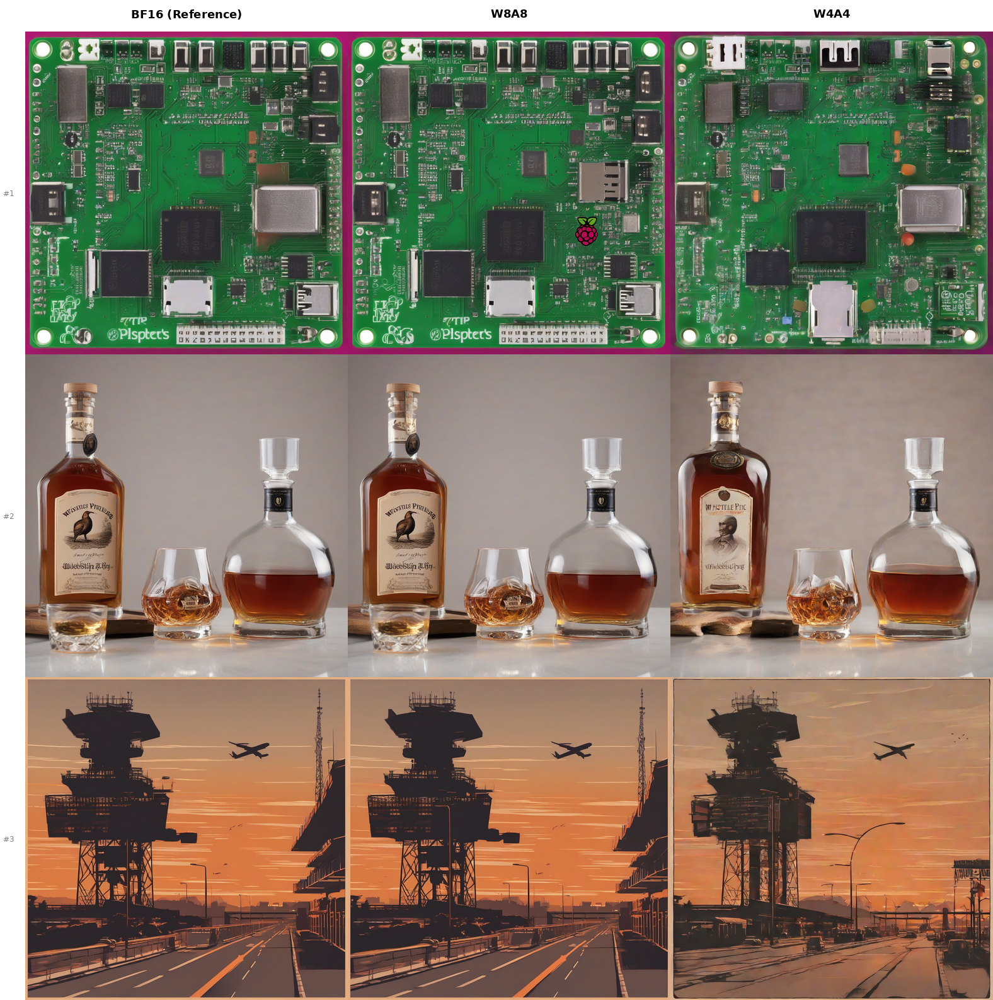

# ConvRot

PyTorch implementation of [ConvRot](https://arxiv.org/abs/2512.03673) — group-wise rotation-based quantization for W4A4 inference on Diffusion Transformers, without retraining.

> **Paper**: [arXiv:2512.03673](https://arxiv.org/abs/2512.03673) &nbsp;|&nbsp; **Original repo**: [feice-huang/ConvRot](https://github.com/feice-huang/ConvRot) &nbsp;|

## FLUX.1-schnell benchmark (DiT, 12B)

Ran on an H200 against torchao baselines (incl. FP8). FLUX is the DiT architecture ConvRot was designed for.

### Visual comparison

Full grid (columns = methods, rows = prompts):


Same prompt, side-by-side (prompt #1 — orange tabby):

| BF16 | torchao FP8 | torchao int8 |
|:---:|:---:|:---:|
|  |  |  |

| torchao int4 | ConvRot W8A8 | ConvRot W4A4+Mixed |
|:---:|:---:|:---:|
|  |  |  |

Prompt #2 — castle at sunset:

| BF16 | ConvRot W8A8 | ConvRot W4A4+Mixed |
|:---:|:---:|:---:|
|  |  |  |

**Quality** (vs BF16):

| Method | Type | PSNR↑ | SSIM↑ | LPIPS↓ |
|--------|------|-------|-------|--------|
| torchao `int8_weight_only` | W8A16 | 29.16 | 0.985 | 0.057 |
| ConvRot W8A8 | W8A8 | 29.07 | 0.985 | 0.061 |
| torchao `float8_weight_only` | FP8 | 26.88 | 0.975 | 0.076 |
| torchao `int4_weight_only` | W4A16 | 21.48 | 0.910 | 0.219 |
| ConvRot W4A4+Mixed | W4A4 | 18.47 | 0.828 | 0.321 |

W8A8 ≈ int8wo on quality while also quantizing activations. On H200, FP8 is strong on quality and memory; ConvRot W4A4 wins on **packed weight size**.

**Performance**:

| Method | DiT size | Reduction | Latency | Peak mem |
|--------|----------|-----------|---------|----------|
| BF16 | 22,681 MB | 1.0x | 1.01 s | 33.8 GB |
| torchao fp8wo | 22,681 MB | 1.0x | 1.31 s | 22.8 GB |
| torchao int8wo | 22,681 MB | 1.0x | 1.29 s | 22.8 GB |
| torchao int4wo | 22,681 MB | 1.0x | 8.82 s | 17.7 GB |
| ConvRot W8A8 | 11,500 MB | 2.0x | 2.16 s | 23.0 GB |
| ConvRot W4A4+Mixed | **6,407 MB** | **3.54x** | 2.64 s | 18.0 GB |

Packed INT4 gets **~3.5×** DiT weight size (paper claims ~4× with fused kernels). Latency is still slower than BF16 — this path dequantizes for matmul; paper speedup needs fused NVFP4/INT4 kernels.

### SDXL proof (UNet, earlier run)



### Paper numbers (RTX 4090, FLUX.1-dev, fused kernels)

| Method | Precision | Memory | Latency | FID↓ |
|--------|-----------|--------|---------|------|
| Baseline | BF16 | 22.7 GiB | 54.6 s | 10.07 |
| SVDQuant | W4A4+LoRA | 6.5 GiB | 14.9 s | 10.01 |
| ConvRot | W4A4 | 5.6 GiB | 23.2 s | 12.32 |
| ConvRot | W4A4+Mixed | 7.0 GiB | 28.3 s | 10.03 |

With fused CUDA kernels the paper gets 4x memory reduction and 2.3x speedup.

## How it works

**Regular Hadamard Transform (RHT)** — The paper's core insight: standard (Sylvester) Hadamard matrices have an all-ones column that amplifies row-wise outliers in DiT activations. Regular Hadamard matrices avoid this:

| Matrix | Column discrepancy | Outlier amplification |
|--------|-------------------|----------------------|
| Sylvester H₂₅₆ | 256 | 160.37 |
| Regular H₂₅₆ | 16 (= √256) | 13.06 |

**Group-wise rotation** — Instead of a global O(K²) rotation, ConvRot partitions features into groups of size N₀ (default 256) and rotates within each group. Complexity drops to O(K).

**Mixed precision** — About 20% of sensitive layers (attention outputs, value projections) stay at W8A8 even when the rest uses W4A4 (paper Table 8). This recovers most of the quality loss.

## Install

```bash
pip install -e .
pip install diffusers transformers accelerate torchao sentencepiece lpips
```

## Usage

```python
from convrot import convrot_quantize_, ConvRotConfig
from convrot.quantize import FLUX_SKIP_LAYERS, FLUX_MIXED_PRECISION_LAYERS

# W8A8
config = ConvRotConfig(precision="w8a8", group_size=256)
convrot_quantize_(dit_model, config)

# W4A4 + mixed precision
config = ConvRotConfig(
    precision="w4a4",
    group_size=256,
    mixed_precision_layers=list(FLUX_MIXED_PRECISION_LAYERS),
    skip_layers=list(FLUX_SKIP_LAYERS),
)
convrot_quantize_(dit_model, config)
```

## Reproduce the benchmark

```bash
# FLUX.1-schnell (4 steps, ~24 GB VRAM)
python benchmark_dit.py --model flux-schnell --num-images 3

# FLUX.1-dev (50 steps, ~32 GB VRAM)
python benchmark_dit.py --model flux-dev --num-images 5 --steps 50

# Skip torchao comparison
python benchmark_dit.py --model flux-schnell --methods bf16 convrot-w8a8 convrot-w4a4-mixed

# SDXL (UNet, ~7 GB)
python generate.py --model sdxl --precision bf16 w8a8 w4a4 --group-size 64 --num-images 3 --steps 20 --use-paper-prompts

# CPU-only algorithm check (no GPU needed)
python examples/cpu_demo.py
```

Or on a remote GPU:

```bash
scp -r . user@gpu-server:~/convrot-torchao
ssh user@gpu-server "cd ~/convrot-torchao && bash run_on_gpu.sh dit"
```

## FLUX skip / mixed-precision layers

From paper Table 8:

| Layer | Precision |
|-------|-----------|
| `transformer_blocks.{i}.attn.to_out.0` | W8A8 |
| `single_transformer_blocks.{i}.attn.to_v` | W8A8 |
| `single_transformer_blocks.37.proj_out` | skip (BF16) |
| `transformer_blocks.18.ff_context.net.2` | skip (BF16) |
| `transformer_blocks.18.ff.net.2` | skip (BF16) |

## Project layout

```
convrot/
├── hadamard.py          # Regular Hadamard matrix (Kronecker product)
├── convrot.py           # Group-wise RHT
├── conv_linear.py       # ConvLinear4bit, ConvLinear8bit
└── quantize.py          # convrot_quantize_(), configs, layer presets
benchmark_dit.py         # FLUX benchmark (this repo's main script)
generate.py              # SDXL image generation + metrics
run_on_gpu.sh            # Remote GPU runner
examples/
├── cpu_demo.py          # CPU-only algorithm verification
├── quick_test.py        # Single-image smoke test
├── quantize_flux.py     # FLUX end-to-end example
├── evaluate_quality.py  # Multi-image quality eval
└── compare_images.py    # Comparison grid builder
tests/
├── test_hadamard.py
├── test_convrot.py
└── test_quantize_api.py
```

## Tests

```bash
pytest tests/ -v
```

## Matching the paper

Paper claims (FLUX.1-dev, RTX 4090, fused kernels): **2.26× speed**, **4.05× DiT memory**, near-BF16 quality with W4A4+mixed.

| Claim | This repo (H200 reference) | How to fully match |
|-------|---------------------------|--------------------|
| ~4× weight memory | **~3.5×** with packed INT4 (6.4 GB vs 22.7 GB) | Close; paper 4.05× needs full packing + fewer BF16 leftovers |
| 2.26× latency | **No** — still dequant→BF16 matmul (slower than BF16) | Needs fused W4A4/NVFP4 GEMM |
| Near-BF16 quality | **Partial** — W8A8 strong; W4A4 weaker than paper / FP8 | FLUX.1-dev + official kernels |
| Model | FLUX.1-schnell (proxy) | `--model flux-dev --steps 50` (needs ~45GB free disk) |

**Important:** the [official ConvRot](https://github.com/feice-huang/ConvRot) now ships **ConvRot + NVFP4** and requires an **NVFP4 GPU (Blackwell, sm_120)**. An H200 (Hopper) cannot run that path. Paper numbers used fused low-bit kernels; our code is the algorithmic reference for torchao review.

Paper-matched eval command (quality / size; not paper latency):

```bash
python benchmark_dit.py --model flux-dev --steps 50 --num-images 5 \
  --methods bf16 torchao-fp8wo torchao-int8wo convrot-w8a8 convrot-w4a4-mixed
```

For paper-level speed on supported hardware, use the official repo’s `quantize.py` / `infer.py` with `configs/flux_dev/.../convrot_nvfp4.yaml`.

## Implementation notes

- **W4A4 weights** are packed 2×INT4 per byte → ~4× smaller than BF16 parameter storage.
- **Forward** still dequantizes to float for matmul. That preserves correctness but **does not** give paper speedups.
- Paper / official speedups come from fused rotate + NVFP4/INT4 tensor-core GEMM.

## References

- Huang et al., *"ConvRot: Rotation-Based Plug-and-Play 4-bit Quantization for Diffusion Transformers"*, arXiv:2512.03673
- [feice-huang/ConvRot](https://github.com/feice-huang/ConvRot) (official; NVFP4 + CUDA/Triton)
- Related: QuaRot, SpinQuant, SVDQuant, NF4

## License

MIT
